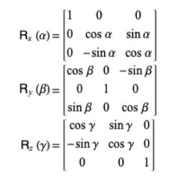

# 3d-engine

For the software and the math behind 3d projections, I was heavily inspired by Youtuber [OneLoneCoder](https://github.com/OneLoneCoder). In the end of this file there are links to relevant files in the repository that show the project in more detail. To see the final result, you can check out the video included. 

## Starting with VGA: VGA Controller

The VGA controller is based on [University of Toronto's VGA Controller](https://www.eecg.utoronto.ca/~jayar/ece241_08F/vga/). Since the DE2-115 board has a 50 MHz clock, we can follow the [timing specifications](http://tinyvga.com/vga-timing/640x480@60Hz) for a 25 MHz, 640x480 VGA signal. In order to reduce memory usage in the board, the resolution is dropped to 320x240.

We will use memory to store the color value of each pixel, with the VGA controller using the x, y index of each pixel to retrieve the data from memory.

## Working with colors: the color palette

To reduce memory use even further, we will operate with a color palette. The color palette will transform the value in the pixel buffer to the three RGB channels that go into the DE2-115 depending on the color matching inside the color palette ROM.

We can work with a reduced 4 color palette, that requires 2 bits in each memory address, but those 4 colors can be any color available by the 3 RGB channels in VGA.

## Adding the NIOS II processor

We now wish to have precise control on each pixel buffer. To do this, we will implement the NIOS II Processor. We wish to connect the output of the NIOS II Processor to the input of the write control of the pixel buffer. This allows us to control the images displayed by changing the values in memory.

There are some limitations with this approach. Every writing cycle for an individual pixel is done at a frequency of 50 MHz. This means that large changes in memory require a sizable amount of time to happen. An undesirable conclusion from this is that images might get rendered by parts in different moments (tearing). This leads to weird transitions from the object not existing in the screen to fully appearing.

A simple solution to this issue is to implement objects as sprites. Sprites are small images that are hardcoded in memory. This images are rendered instead of the main pixel buffer when some control signals allows it. In order to control where and when sprites get rendered, we only need to change a few registers instead of the total memory space that the sprite occupies.

## Solving tearing: double buffering

The sprite methods is suitable for 2D applications, where the shape of an object is usually constant and the things that change are usually only the position. For 3D applications, we require more control of individual pixels so sprites do not solve the tearing issue. This section we will develop how the use of a double pixel buffer can help solve this issue.

The idea being double buffering is that the data of the rendered image is present in two buffers, a front buffer and a back buffer. In most cycles, the VGA controller reads the data from the front buffer. When the processor starts a writing cycle, it writes to the back buffer. When the writing process is over, the VGA controller reads the data from the back buffer instead and the front buffer gets updated with the back buffer data. After one cycle is done, the VGA controller returns to read from the front buffer. Since rendering requires reading each pixel of the buffer, writing the new data to the front buffer only takes one cycle, so the image goes from not existing to being fully rendered without any intermediate rendering.

The processor first waits for the control signal swap to start the process of writing (this prevents the processor from updating the back buffer when the front buffer is being updated). It then sets the control signal done to low (this control signal signifies that the processor has a finished a writing cycle). After that, the processor writes the new color values to the back buffer. It then sets done high, and waits for the writing cycle to be completed before making done low again.

There are still some limitations with this approach. Although we do not have tearing anymore, the image will not appear on screen until all the pixels have been written to the back buffer. This means that large images take a long time to appear on screen. This delay can become meaningful when we expect to update the image in short periods of time. This problem will be explained in the (Software)[#Software-3D-Graphics-Matrices-and-more] section.

## Software

### The Projection Matrix

In order to represent 3D space in 2D space, we need to translate 3D coordinates (x, y, z) into 2D coordinates (x', y'). This process requires the implementation of matrix multiplication, which will be recycled for other transformations like rotations. For Projection specifically, we will multiply the (x, y, z) vector with the projection matrix. The result will give us how that 3D vector could be represented using only 2D coordinates.

We create the following function to get the projection matrix. This matrix takes several parameters of our display (aspect ratio, depth, etc.) and maps a determined coordinate into the actual (x, y) pair that gets displayed.
```
void getmatProj(mat4x4 &matProj){
	float fNear = 10000.0f;
	float fFar = 100000.0f;
	float fFov = 90.0f;
	float fAspectRatio = (float) 240 / (float) 320;
	float fFovRad = 1.0f / tanf(fFov * 0.5f / 180.0f * 3.14159f);

	matProj.m[0][0] = fAspectRatio * fFovRad;
	matProj.m[1][1] = fFovRad;
	matProj.m[2][2] = fFar / (fFar - fNear);
	matProj.m[3][2] = (-fFar * fNear) / (fFar - fNear);
	matProj.m[2][3] = 1.0f;
	matProj.m[3][3] = 0.0f;
}
```

### Rotations

We are also interested in rotating objects. Rotations are also fairly straightforward. Using the following reference we can setup a rotation matrix for each of the three axis similar to the Projection Matrix. .

### Scaling Into View

To work with the Projection matrix, we understand the center of the screen as the (0,0) point. In reality, the center of our screen is really at (160, 120). To move the projected point into position, we will add `1.0f` and `1.0f` to both x and y coordinate, and then multiply that value of x by 160 and the value of y by 120.

### Fast Refresh: replacing `fillScreen(0)`

Up to this point, rendering an object in the screen had two steps. First, we would wipe out any images from memory by replacing the buffer value with a 0. Second, we would write the object data to the buffer. This meant that every refresh cycle took a long time, since the entire memory needed to be written before the new object could be added. This made our frame rate close to 0.7 frames/sec.

In order to solve this issue, we changed the approach. Instead of wiping the entire memory, we would add the previously created elements into a vector. In the next render cycle, those elements in the vector will be wiped out by writing 0 to memory instead of the color value assigned to it. This meant that instead of having to wipe out the entire memory, we would only need to wipe out a smaller amount of pixels. If the previous image had N pixels and the new image had M pixels, we will need to write to N + M pixels before we can render the new object. This is generally much lower than the previous amount, which was 640*320 + M.  

### Sorting Triangles: the Painter's algorithm

In order to get the actual image of the object, we want to see the closer triangles to us first. So before we set the Triangles in the buffer, we will sort them out by their z-coordinate and then we will draw it on the screen.

### Further simplification: the World's matrix

In order to simplify the transformations we are making in the making function, we can collapse the different translations and rotations into a single matrix operation. For this we will need to implement a matrix by matrix multiplication function and it would also be convenient to have a triangle by matrix function. The old functions are still useful to rotate and project individual graphics like points or triangles.

### MATLAB
MATLAB function `imread()` reads the image file into a three channel array with the RGB code of each pixel. Then `imresize(,[x y])` resizes the original image to fit the VGA resolution. `rgb2ind(, number_of_colors)` transforms the RGB array into a single channel array.

## Important files

In the hdl folder, you can find al SystemVerilog design files for the different components. In the platform designer folder, you can find the processor .qsys file. Go into the  folder to find the header and source files for the code in this project.
